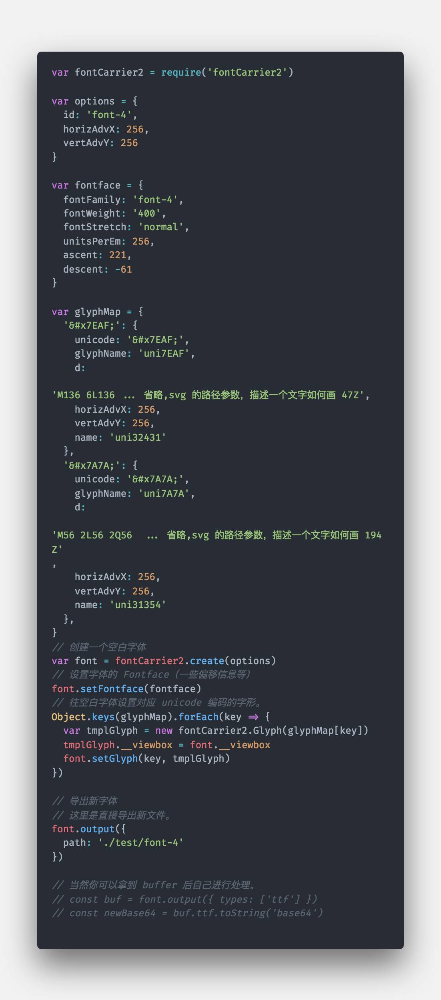

title: 再谈中文字体的子集化与动态创建字体
date: 2019-06-04 19:31:00
tags: [字体,node,JS,webfont]
categories: [前端技术,node]
---

> 其实在项目中用中文字体子集化已经很久了，在刚接受到项目时真的让用户去下载全量字体的方式也早已被废除。如今终于有时间将它整理成文。算是对这件事情的一个基本了结吧。

## 为什么要截取字体？

众所周知，相对于英文字体，中文字体就是一个“庞然大物”。英文字体 `200～300KB` 已经很大了，而中文字体 动戈 `10~30MB`。
这主要是两个方面的原因：

1. 中文字体包含的字形数量极多 英文字体则只需包含几十个基本字符和符号。有些中文字体还要包括韩语和日语的字形。
2. 中文字形的曲折变化复杂度高，用于控制中文字形曲线的控制点普遍比英文更多，由于数据量不一样，字体大小也自然就有这样的膨胀了

<!-- more -->

但是需求总是有的，在一些特殊的视觉效果，或者是在一些富文本（如海报设计类）的编辑场景下，特殊字体的支持更是必不可少的。 但是一个中文字体 `10～20Mb` 我网站可能支持100种字体，你让用户都全量下载显然是不可能的！并且也不是每个页面都会用到一个字体文件中的所有字符，全量加载本身也极其浪费。

在《通用汉字表》中一级表确定 3500 常用中文汉字（中国义务教育9年级需要掌握的汉字数量）即可覆盖日常使用汉字的99.8%

## 如何使用自定义字体。

在真正开始之前，我们先来回顾一下，如何去让一个文本使用自定义字体。这里我们会聊到 `@font-face`，这就是我们目前前端最常用的Web自定义字体技术。

[示例代码：https://css-tricks.com/snippets/css/using-font-face/](https://css-tricks.com/snippets/css/using-font-face/)
这里取了其中一个最全的方案，基本上能够兼容到所有的浏览器。

```css
@font-face {
  font-family: 'MyWebFont';
  src: url('webfont.eot'); /* 兼容IE9 */
  src: url('webfont.eot?#iefix') format('embedded-opentype'), /* IE6-IE8 */
       url('webfont.woff2') format('woff2'), /* 最新浏览器 */
       url('webfont.woff') format('woff'), /* 较新浏览器 */
       url('webfont.ttf')  format('truetype'), /* Safari、Android、iOS */
       url('webfont.svg#svgFontName') format('svg'); /* 早期iOS */
}
<!--使用-->
.newfont {
    font-family: 'MyWebFont';
}
```

当然除了直接使用 `@font-face` ，还可以使用 `@import` 规则或 `link` 元素导入或加载包含 `@font-face` 声明的外部文件：

使用 google open font （[360 奇舞 cdn 的 google font 镜像](https://cdn.baomitu.com/index/fonts)）
```html
// 导入
@import url(//fonts.googleapis.com/css?family=Open+Sans);
// 或者引用
<link href='//fonts.googleapis.com/css?family=Open+Sans' rel='stylesheet' type='text/css'>
// 实际使用
body {
  font-family: 'Open Sans', sans-serif;
}
```
关于字体如何使用就简单介绍到这，网上也已经有很多各种各样的教程。不再过多赘述。 其实目前 iconfont.cn 这类字体图标的网站就是这样的技术。


## 字体如何截取？

### 1. unicode-range

`unicode-range` 是一个 CSS 属性，一般和 `@font-face` 规则一起使用。它只是在本地既有字体或者浏览器已经下载的字体基础上做一个指向子集的“软链接”，并不能真正减小浏览器下载文件的大小。

对于这种技术由于并不能真正的减少字体大小，所以也不在这我篇文章的范围内。给两个参考链接给大家观看了解。

- [前端字体截取：实战篇](https://github.com/75team/w3c/blob/master/articles/20181024_%E5%89%8D%E7%AB%AF%E5%AD%97%E4%BD%93%E6%88%AA%E5%8F%96%EF%BC%9A%E5%AE%9E%E6%88%98%E7%AF%87.md)
- [张鑫旭 - CSS unicode-range特定字符使用font-face自定义字体](https://www.zhangxinxu.com/wordpress/2016/11/css-unicode-range-character-font-face/)

### 2. 全量字体精简

> 即在服务端从“全量”字体中分离出一个体积相对极小的字体子集，做成 webfont 通过 Web 服务器或 CDN 下发给浏览器。

这里需要介绍笔者 fork 之后修改的一个库: [font-carrier2](https://github.com/guowenfh/font-carrier2)
项目 fork 自 font-carrier。 由于 font-carrier 有很长时间无人维护，但是我又有需求。然后就特此开一个新分支。做一些特性的更新与 bug 的修复。

下面给出一种精简中文字体的方式。
```js
var fontCarrier2 = require('font-carrier2')
var transFont = fontCarrier2.transfer('./test/test.ttf')
// 会自动根据当前的输入的文字过滤精简字体
transFont.min('我是精简后的字体，我可以重复')
// 产生一个新字体
transFont.output({
  path: './test/minFont'
})
```
使用新字体：（这样这个新字体中只有`《我是精简后的字体，我可以重复》`这几个字）
```css
  @font-face {
    font-family: 'minFont';
    src:url('./test/minFont.eot'); /* IE9 */
    src: url('./test/minFont.eot?#iefix') format('embedded-opentype'), /* IE6-IE8 */
    url('./test/minFont.woff2') format('woff2'),
    url('./test/minFont.woff') format('woff'),
    url('./test/minFont.ttf') format('truetype'), /* chrome、firefox、opera、Safari, Android, iOS 4.2+*/
    url('./test/minFont.svg#iconfont'); /* iOS 4.1- */
  }
```

可以看到我们这里很简单的就将一个中文字体给子集化了，那么关于 `font-carrier2` 如何去子集化一个字体我们也简单介绍到这。下面我们来进入重头戏：**到底是如何做到精简的**。

## 字体解析。(font-carrier2 基本思路剖析)

关于如何解析一个字体的话，其实都是有对应规范的：这个是其中一个规范的描述。[microsoft-The OpenType Font File](https://docs.microsoft.com/en-us/typography/opentype/spec/otff)
其实也就是我们如何从一个二进制的流（当然会转化成 buffer ）中，转化成一个人类可读的对象。(psd.js（一个解析psd为json的库，其实也是在做一个类似的事情。）)
这一步 [opentype.js](https://opentype.js.org/) 已经帮我们做得很好了。 他能够解析 `ttf otf woff` 三种文件格式解析为一个 font 类。那么我们拿到这个 font 类 之后就可以去做我们任何想做的事情了。**那么对于一个 `webfont` 来说有哪些是最关键的呢？**

1.解读字体内容 

```js
// 其实我们就用这些东西足够去创建一个字体了
// 首先我们使用 opentype 解析一个字体文件读取之后的 buffer 。
var font = opentype.parse(toArrayBuffer(fs.readFileSync('font.tff'))) 
// 这些内容可以在 opentype.js 官网中看到详细信息
var hhea = font.tables.hhea // Horizontal Header table
var head = font.tables.head // Font Header table
var name = font.tables.name  // 存储了原字体 名称相关信息。处理 fontFamily 
var glyphs = font.glyphs.glyphs // 重点（存储了所有的 字形的列表。
```
2.生成一个简单的 `fontObjs` 数据对象


```js
 var _ = require('lodash')
 var fontObjs = {
      options: {
        id: name.postScriptName.en || 'iconfont',
        horizAdvX: hhea.advanceWidthMax || 1024,
        vertAdvY: head.unitsPerEm || 1024
      },
      fontface: {
        fontFamily: name.fontFamily.en || 'iconfont',
        ascent: hhea.ascender,
        descent: hhea.descender,
        unitsPerEm: head.unitsPerEm
      },
      glyphs: {}
    }
    var path, unicode
    _.each(font.glyphs.glyphs, function(g) {
      try {
        path = g.path.toPathData()
        if (_.isArray(g.unicodes)) {
          _.each(g.unicodes,function(_unicode){
            unicode = '&#x' + (_unicode).toString(16) + ';'
            if(unicode === '&#x20;' || unicode === '&#x2005;' || path){
                fontObjs.glyphs[unicode] = {
                    d: path,
                    unicode: unicode,
                    name: g.name || 'uni' + _unicode,
                    horizAdvX: g.advanceWidth,
                    vertAdvY: fontObjs.options.vertAdvY
                }
            }
          })
        }
      } catch (e) {}
    })
```
3.`glyphs` 精简。 glyphs 这个时候已经是一个对象了。 `key` 为 文字对应的 `unicode`， `value` 实际上是一个 `svg` 字体中对应 `glyphs` 的信息。具体可以查看：[MDN - SVG 字体](https://developer.mozilla.org/zh-CN/docs/Web/SVG/Tutorial/SVG_fonts) 里面 `glyphs` 对应的部分。如果需要精简的话 那么我们其实只要从这个 `glyphs` 对象里面 提取所需要文字对应的 `unicode` 就行了。
4.转化成 `svg` 字体。这个其实就是将 上面 提到的 `fontObjs`，和需要提取的文字精简过后的 `glyphs` 转化成 `MDN - SVG 字体`。这个其实也是 `fontCarrier2` 中比较重要的部分。
5.生成各种字体。`fontCarrier2` 就是直接先生成一个 `svg` 的字符串，然后通过 `svg2ttf` 转化成 `ttf buffer` 。（本着不多次重复造轮子的原则。在网上可以找到各种字体转化的库 比如 `svg2ttf` `ttf2woff`.. 等。然后再通过 `ttf2woff`/`ttf2woff2` 等.. 转化成其他的字体文件。（这样当然性能不是最高的。不过实现会快很多。）
6.在前端使用 `font-face + font-family ` 引用新的字体。

那么 `font-carrier2` 的基本思路剖析 我们就到这了。通过上面这些步骤我们就实现了一个中文字体的子集化。下面我们再聊聊动态创建字体思路。

## 动态创建字体

先来看一下 在 `font-carrier2` 中如何通过空白字体去创建文字。具体效果可以在库中 `test/index.html` 看到。

- [https://github.com/guowenfh/font-carrier2/blob/master/test/create_test.js](https://github.com/guowenfh/font-carrier2/blob/master/test/create_test.js)
- 

其实这个图看完。结合我们之前我们看的 `font-carrier2` 处理流程。 我们动态创建字体的思路就很明确了。

1. 解析字体 得到 `fontObjs` ，(`options` & `fontface` & `glyphs`)。
2. 把 `fontObjs` 存下来（各种存储方式任选：内存/文件/redis/数据库...）
3. 前端发送请求。（ `font-family`和对应的文字（`"simplified":"纯空白 迷你简硬笔楷书 字体测试1，2，3"`）
4. 服务端接受到请求。通过 将接受到的文字转化成 `unicode`, 然后再通过 `font-family`，取到 `options` & `fontface` & `glyphs` 对应的值。**创建一个新字体**。返回给前端。
5. 前端接受到返回。创建 `font-face` 插入到 `style` 插入 html
6. 你还能通过 `fontfaceobserver` 这个库来监听字体是否生效。（ canvas 的 fillText 不会在字体更新后自动刷新
7. 然后就是正常使用了。


在笔者目前的项目中使用的是上述的流程。

不过也非固定，第 4 步之后 是一个分支流程。
通过后端去创建字体可能对服务端造成较大压力。由于我们去创建一个字体的基本信息都存下来了。
那么其实也可以后端只做存储相关的工作。 通过在浏览器直接操作 `ArrayBuffer`和 `blob` （其实 `opentype.js`把这个也实现了）利用客户的浏览器去生成字体（目前市面上调研到几个做子集化公司付费解决方法。

文章到这就基本结束了。相信看下来应该对中文字体的子集化应该会有一个基本上的了解。
`font-carrier2` 和 `opentype.js` 还有很多特点没介绍到。剩下的就交给各位自己去想象了。


